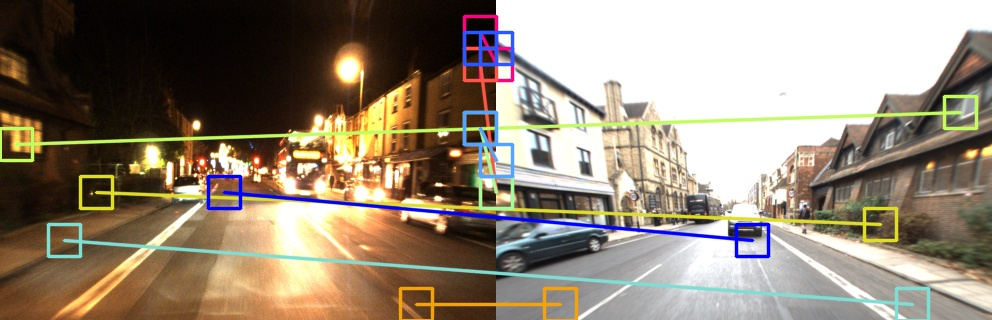
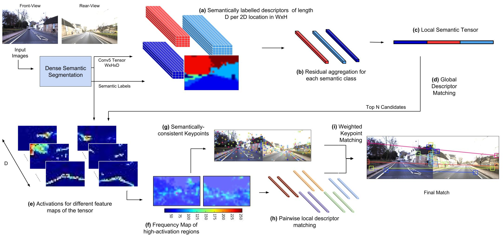

# LoST? Appearance-Invariant Place Recognition for Opposite Viewpoints using Visual Semantics

This is the source code for the paper titled - "LoST? Appearance-Invariant Place Recognition for Opposite Viewpoints using Visual Semantics", pre-print available [here](https://arxiv.org/abs/1804.05526).

An example output image showing Keypoint Correspondences:




Flowchart of the proposed approach:



If you find this work useful, please cite it as:  
Sourav Garg, Niko Sunderhauf, and Michael Milford. LoST? Appearance-Invariant Place Recognition for Opposite Viewpoints using Visual Semantics. Proceedings of Robotics: Science and Systems XIV, 2018.  
bibtex:
```
@article{garg2018lost,
title={LoST? Appearance-Invariant Place Recognition for Opposite Viewpoints using Visual Semantics},
author={Garg, Sourav and Suenderhauf, Niko and Milford, Michael},
journal={Proceedings of Robotics: Science and Systems XIV},
year={2018}
}
```
RefineNet's citation as mentioned on their [Github page](https://github.com/guosheng/refinenet).


## Setup and Run

#### Dependencies
- Ubuntu        (Tested on *14.04*)
- [RefineNet](https://arxiv.org/abs/1611.06612)
  - Required primarily for visual semantic information. Convolutional feature maps based dense descriptors are also extracted from the same.
  - A [modified fork](https://github.com/oravus/refinenet) of RefineNet's [code](https://github.com/guosheng/refinenet) is used in this work to simultaneously store convolutional dense descriptors.
  - Requires Matlab      (Tested on *2017a*)
- Python        (Tested on *2.7*)
  - numpy       (Tested on *1.11.1*, *1.14.2*)
  - scipy       (Tested on *0.13.3*, *0.17.1*)
  - skimage     (Minimum Required *0.13.1*)
  - sklearn     (Tested on *0.14.1*, *0.19.1*)
  - h5py        (Tested on *2.7.1*)
- Docker (optional, recommended, tested on *17.12.0-ce*)
  - [Official page for install instructions](https://docs.docker.com/install/linux/docker-ce/ubuntu/)


#### Download

1. In your workspace, clone the repositories:
   ```
   git clone https://github.com/oravus/lostX.git
   cd lostX
   git clone https://github.com/oravus/refinenet.git
   ```
   NOTE: If you download this repository as a zip, the refineNet's fork will not get downloaded automatically, being a git submodule.
2. Download the Resnet-101 model pre-trained on Cityscapes dataset from [here](https://drive.google.com/drive/folders/1U2c1N6QJdzB_8HBgXb7mJ6Qk66JDBHI9) or [here](https://pan.baidu.com/s/1nxf2muP#list/path=%2Frefinenet_public_new%2Frefinenet_released%2Frefinenet_res101&parentPath=%2Frefinenet_public_new%2Frefinenet_released). More details on RefineNet's [Github page](https://github.com/guosheng/refinenet).
   - Place the downloaded model's `.mat` file in the `refinenet/model_trained/` directory.
3. If you are using docker, download the docker image:
   ```
   docker pull souravgarg/vpr-lost-kc:v1
   ```


#### Run
1. Generate and store semantic labels and dense convolutional descriptors from RefineNet's *conv5* layer
   In the MATLAB workspace, from the `refinenet/main/` directory, run:
   ```
   demo_predict_mscale_cityscapes
   ```
   The above will use the sample dataset from `refinenet/datasets/` directory. You can set path to your data in `demo_predict_mscale_cityscapes.m` through variable `datasetName` and `img_data_dir`.  
You might have to run `vl_compilenn` before running the demo, please refer to the instructions for running refinenet in their official [Readme.md](https://github.com/guosheng/refinenet)

2. \[For Docker users\]  
If you have an environment with python and other dependencies installed, skip this step, otherwise run a docker container:
   ```
   docker run -it -v PATH_TO_YOUR_HOME_DIRECTORY/:/workspace/ souravgarg/vpr-lost-kc:v1 /bin/bash
   ```
   From within the docker container, navigate to `lostX/lost_kc/` repository.  
`-v` option mounts the *PATH_TO_YOUR_HOME_DIRECTORY* to */workspace* directory within the docker container.
3. Reformat and pre-process RefineNet's output from `lostX/lost_kc/` directory: 
   ```
   python reformat_data.py -p $PATH_TO_REFINENET_OUTPUT
   ```
   $PATH_TO_REFINENET_OUTPUT is set to be the parent directory of `predict_result_full`, for example, *../refinenet/cache_data/test_examples_cityscapes/1-s_result_20180427152622_predict_custom_data/predict_result_1/*
4. Compute LoST descriptor:
   ```
   python LoST.py -p $PATH_TO_REFINENET_OUTPUT 
   ```
5. Repeat step 1, 3, and 4 to generate output for the other dataset by setting the variable `datasetName` to `2-s`.
6. Perform place matching using LoST descriptors based difference matrix and Keypoint Correspondences:
   ```
   python match_lost_kc.py -n 10 -f 0 -p1 $PATH_TO_REFINENET_OUTPUT_1  -p2 $PATH_TO_REFINENET_OUTPUT_2
   ```
Note: Run `python FILENAME -h` for any of the python source files in Step 3, 4, and 6 for description of arguments passed to those files. 


## License
The code is released under MIT License.

## Related Projects
[Delta Descriptors (2020)](https://github.com/oravus/DeltaDescriptors)

[CoarseHash (2020)](https://github.com/oravus/CoarseHash)

[seq2single (2019)](https://github.com/oravus/seq2single)


